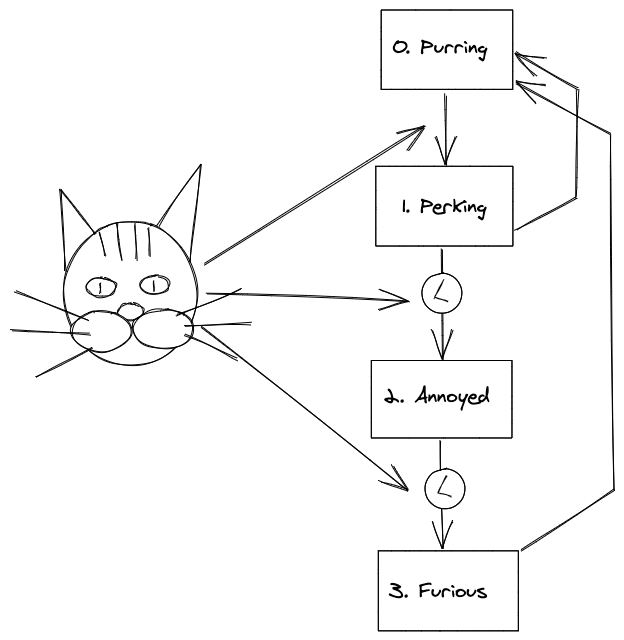

## Kitty Fash

> Flush 'em all!

Project to support kitties to flush things.

0. Everyting starts with purring.

1. Transition from perking to annoyed is timed, machine resets to purring in case we do not see kitty long time enough.

2. Similary transition form annoyed to furious is timed, timer is reset when we see kitty. But in contrast it does not transition into different state, just continues to be annoyed.

3. And finaly after it furious it gets back to purring.

Kitty flush cycle complete!
